# Gallery: the output, without running anything

> **SYNTHETIC DEMONSTRATION.** Hypothetical hotspot, assumed parameters, not a
> real site and not field validated. Reactive caps and activated-carbon
> amendments are established practice and no novelty is claimed for them. The
> modelled attenuation is **above** what field caps have achieved, which is
> stated and sourced in [`../EVIDENCE_BASE.md`](../EVIDENCE_BASE.md).

Everything here was generated by

```bash
python tools/build_gallery.py --out docs/gallery
```

and committed, so a reviewer can see the result before deciding whether to
install anything. **That command takes about forty minutes**, which is exactly
why the output is committed: nobody should have to run it to look at it. For a
single scenario in about seventy-five seconds, use
`python -m reactive_seabed_mat.cli quick --out results` instead.

* **[`index.html`](index.html)** is the full page: every scenario, every map,
  interactive, offline, Plotly inlined once. GitHub will not render it in the
  browser, so download it or clone the repository and open it. It needs no
  network, no account and no tile server.
* The PNGs below are previews, drawn with matplotlib so that GitHub renders them
  here directly.

---

## The comparison the project is about

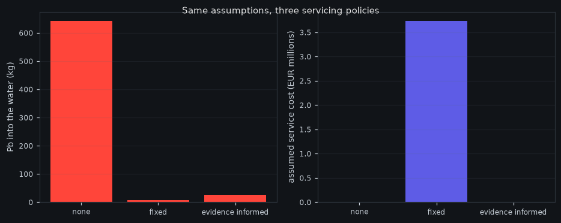

Scenario B over six years. Same seed, same forcing, same hotspot schedule, same
observation schedule. Only `PolicyConfig.kind` differs.

| Policy | Pb into the water | Services | Assumed cost |
|---|---|---|---|
| no mat | 642.3 kg | 0 | EUR 0 |
| fixed calendar servicing | 6.7 kg | 2 | EUR 3.73 M |
| evidence-informed servicing | 26.4 kg | 0 | EUR 0 |

The mat works: 642 kg down to single figures. But **evidence-informed servicing
under-services**, letting about four times more lead through than a calendar
while spending nothing. That is the finding, not a defect. With chemistry on one
tile out of nine, no seepage measurement, and a capacity known only from a
commissioning test, the estimated saturation interval never narrows enough to
justify sending a vessel.

*The value of evidence-informed maintenance is bounded by the monitoring
programme that feeds it.*

Every euro value is an assumption. No supplier has been contacted and no
quotation exists.

---

## Scenario A: `fresh_mat`

A fresh, fully covering mat over a moderate hotspot, against the same hotspot
with no mat under identical forcing.

| Residual flux at the seabed | Through time |
|---|---|
| 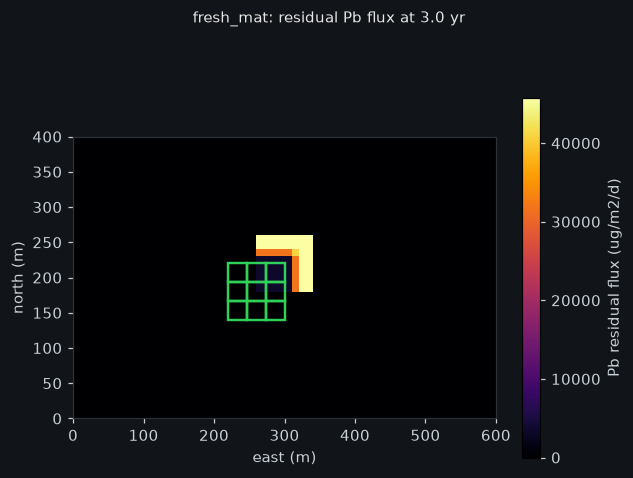 | 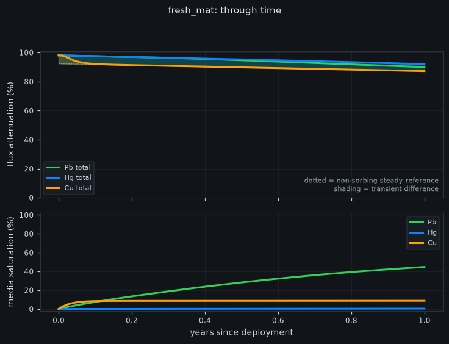 |

## Scenario B: `progressive_saturation`

The same source over six years. The medium loads, attenuation falls and the
layer breaks through. Only the duration differs from A.

| Residual flux at the seabed | Through time |
|---|---|
| 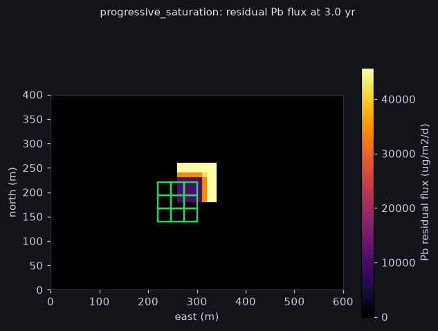 | 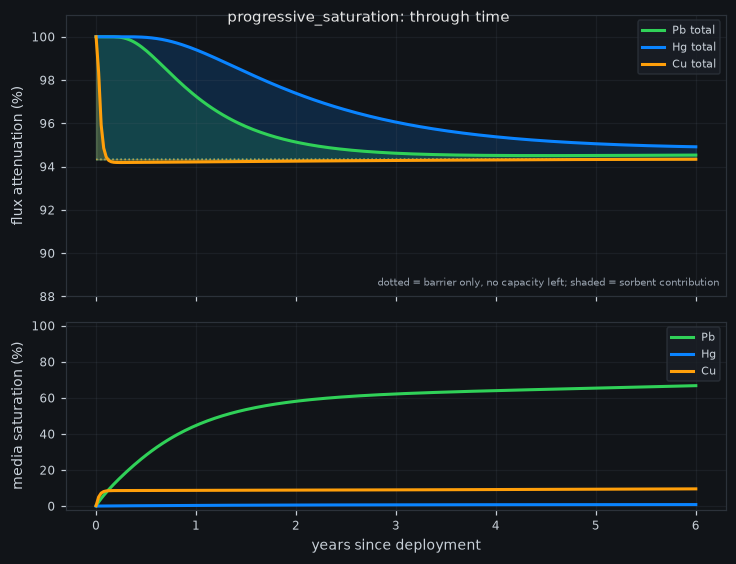 |

## Scenario C: `increased_leak`

After two years the porewater concentration triples and the seepage velocity
doubles. The mat is unchanged, so a rising residual flux means a stronger
source, not a failing cap. Telling those apart is the estimator's job, and it
declines to replace the mat on this evidence.

| Residual flux at the seabed | Through time |
|---|---|
| 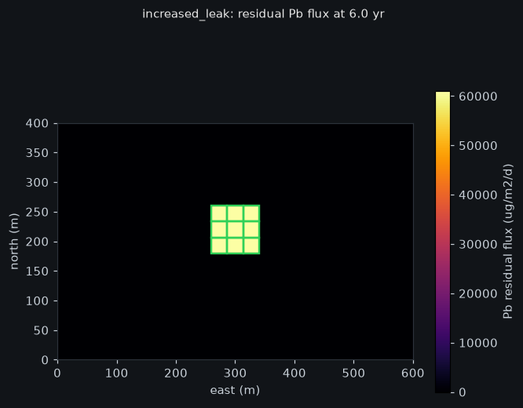 | 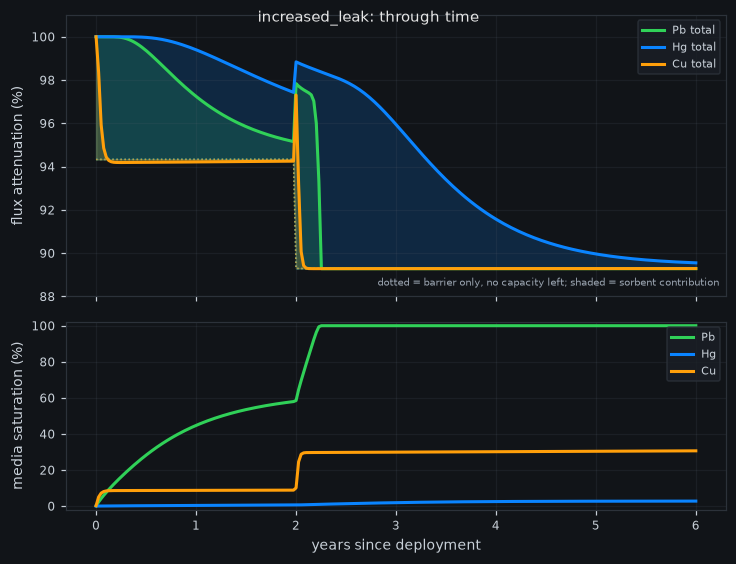 |

## Scenario D: `displaced_section`

One tile displaced off its footprint, another punctured. The failure is local:
those cells return to the bare flux while their neighbours keep working. Tile
outlines are colour-coded: green intact, amber torn, red displaced, blue buried.

| Residual flux at the seabed | Through time |
|---|---|
| 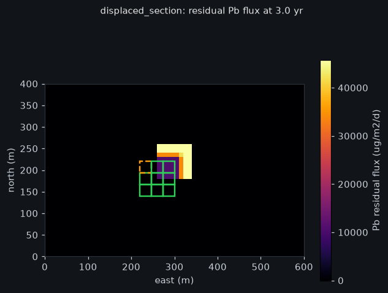 | 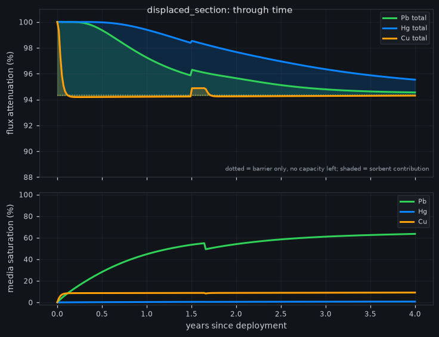 |

## Scenario E: `delayed_chemistry`

Probe dropout, then drift, with laboratory chemistry still in transit. The late
result changes the maintenance decision when it arrives, and not before: the
controller reads a record only once its `available_at_utc` has passed.

| Residual flux at the seabed | Through time |
|---|---|
|  | 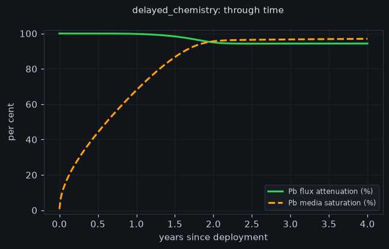 |

## Scenario F: `undersized_mat`

A deliberately poor design: 45 % coverage, 2 mm thick, over a seep three times
stronger. Poor capture and a bad cost per kilogram. This scenario exists so the
demonstration is not tuned to succeed, and it is a real outcome of the same
equations rather than a special case.

| Residual flux at the seabed | Through time |
|---|---|
| 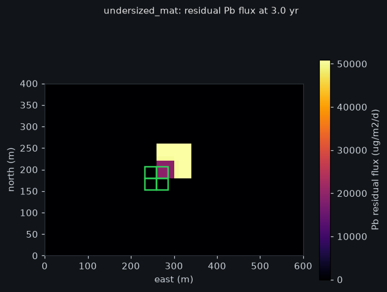 | 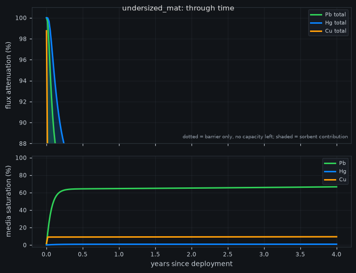 |

---

## How to read the attenuation curve

It starts above 99 % and settles near 94 %. Both numbers need a caveat.

**The plateau.** Once the chemistry is exhausted the mat is still a physical
diffusive barrier, so it keeps attenuating. The sorbent's chemical contribution
is the *difference* between the two figures, not the whole thing.

**The peak.** 99 % is above anything a real cap has achieved. In-situ thin-layer
capping with activated carbon in Trondheim harbour cut measured sediment-to-water
fluxes by a factor of 2 to 10, that is 50 % to 90 %. This model has uniform
seepage, no bioturbation, no consolidation and perfect mat-to-sediment contact,
so its figure is an upper bound set by the physics we chose to include. Sources
in [`../EVIDENCE_BASE.md`](../EVIDENCE_BASE.md).
