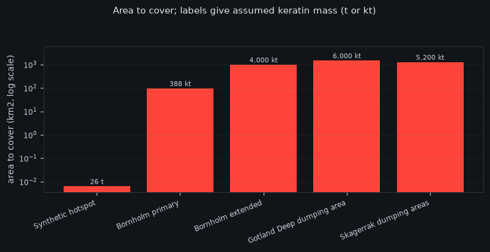

# Gallery: the output, without running anything

> **SYNTHETIC DEMONSTRATION.** Hypothetical hotspot, assumed parameters, not a
> real site and not field validated. Reactive caps and activated-carbon
> amendments are established practice and no novelty is claimed for them; the
> geotextile-core-geotextile construction in particular is a patented commercial
> product. The modelled attenuation is **above** what field caps have achieved,
> which is stated and sourced in [`../EVIDENCE_BASE.md`](../EVIDENCE_BASE.md).

## Read this before the pretty pictures

Three results here work against the technology, and they are the ones worth your
attention.

1. **The sorbent contributes far less than the headline.** The mat attenuates
   about 94 %, but a mat with **no chemical capacity at all** attenuates 94.3 %
   on geometry alone. At six years the keratin adds **0.19 pp for Pb, 0.58 pp
   for Hg, and 0.00 pp for Cu**. On the timeline plots that is the shaded band
   between each solid curve and its dotted floor. For copper there is no band.
2. **Copper is not removable by this chemistry.** Above 99 % of dissolved Cu in
   seawater is bound to strong organic ligands with stability constants around
   10^15. Copper has the best published keratin capacity of the three metals and
   the worst prospects in seawater. Capacity is not availability.
3. **The area defeats it.** The Bornholm primary dumpsite is 97 km²: about
   388,000 t of keratin, a fifth of one year's global wool clip, tens of billions
   of euro of material. See the log-scale figure below and
   [`../DEPLOYMENT_SCALE.md`](../DEPLOYMENT_SCALE.md).
4. **The best-funded munitions site is one this material cannot treat.** Ranking
   candidates by receptor proximity correctly puts coastal sites first and the
   famous offshore dumpsite last. But what is measured reaching biota at the
   German coastal dumpsites is **TNT, RDX and DNT**, and a keratin thiol core
   binds soft metals, not nitroaromatics. The priority chart in `index.html`
   colours that in: green where the chemistry matches, red where it does not.

Measured a different way the chemistry looks better: of the lead that actually
*enters* the layer, the mat keeps about 27 %. Both numbers are true. The first
answers "how much less reaches the sea", the second answers "is the sorbent
doing anything". We show both.



Everything here was generated by

```bash
python tools/build_gallery.py --out docs/gallery
```

and committed, so a reviewer can see the result before deciding whether to
install anything. **That command takes about forty minutes**, which is exactly
why the output is committed: nobody should have to run it to look at it. For a
single scenario in about seventy-five seconds, use
`python -m reactive_seabed_mat.cli quick --out results` instead.

* **[`index.html`](index.html)** is the full page: every scenario, every map,
  interactive, offline, Plotly inlined once. GitHub will not render it in the
  browser, so download it or clone the repository and open it. It needs no
  network, no account and no tile server.
* The PNGs below are previews, drawn with matplotlib so that GitHub renders them
  here directly.

---

## The comparison the project is about


Scenario B over six years. Same seed, same forcing, same hotspot schedule, same
observation schedule. Only `PolicyConfig.kind` differs.

| Policy | Pb into the water | Services | Assumed cost |
|---|---|---|---|
| no mat | 642.3 kg | 0 | EUR 0 |
| fixed calendar servicing | 15.9 kg | 2 | EUR 3.73 M |
| evidence-informed servicing | 28.4 kg | 0 | EUR 0 |

The mat works: 642 kg down to tens of kilograms. But **evidence-informed
servicing under-services**, letting about 1.8 times more lead through than a
calendar while spending nothing. That is the finding, not a defect. With chemistry on one
tile out of nine, no seepage measurement, and a capacity known only from a
commissioning test, the estimated saturation interval never narrows enough to
justify sending a vessel.

*The value of evidence-informed maintenance is bounded by the monitoring
programme that feeds it.*

**It is not simply inert, though.** Look at scenario D below: when a tile is
displaced and another punctured, the evidence-informed policy *does* service,
because a damage class from an ROV inspection is unambiguous in a way that a
falling flux number is not. It acts on what it can see and declines on what it
cannot, which is the behaviour you would want and the reason the two cases look
different.

Every euro value is an assumption. No supplier has been contacted and no
quotation exists.

## All six scenarios at a glance

| | Scenario | Years | Final attenuation | Media saturation | Effective coverage | Pb retained | Services |
|---|---|---|---|---|---|---|---|
| A | `fresh_mat` | 1.0 | 97.2 % | 45 % | 100 % | 6.89 kg | 0 |
| B | `progressive_saturation` | 6.0 | 94.5 % | 67 % | 100 % | 10.3 kg | 0 |
| C | `increased_leak` | 6.0 | 89.3 % | 100 % | 100 % | 15.5 kg | 0 |
| D | `displaced_section` | 4.0 | 94.6 % | 64 % | 96 % | 10.7 kg | 1 |
| E | `delayed_chemistry` | 4.0 | 94.5 % | 64 % | 100 % | 9.86 kg | 0 |
| F | `undersized_mat` | 4.0 | 84.6 % | 67 % | 100 % | 0.923 kg | 0 |

Attenuation and saturation are for lead, the primary channel. Only scenario C
drives the medium to full saturation, because it is the one where the source
gets stronger; elsewhere the capped isotherm settles below full load.

Scenario F is the honest one: a 45 % coverage, 2 mm mat over a seep three times
stronger retains **0.92 kg** where the properly sized mat retains 10.3, and its
attenuation is the worst of the six. It also ends up the least monitored,
because a 2x2 mat has no tile for the benthic chamber station the larger layouts
use. That was not designed in; it fell out of the same configuration and is left
visible.

---

## Scenario A: `fresh_mat`

A fresh, fully covering mat over a moderate hotspot, against the same hotspot
with no mat under identical forcing.

| Residual flux at the seabed | Through time |
|---|---|
|  |  |

## Scenario B: `progressive_saturation`

The same source over six years. The medium loads, attenuation falls and the
layer breaks through. Only the duration differs from A.

| Residual flux at the seabed | Through time |
|---|---|
|  |  |

## Scenario C: `increased_leak`

After two years the porewater concentration triples and the seepage velocity
doubles. The mat is unchanged, so a rising residual flux means a stronger
source, not a failing cap. Telling those apart is the estimator's job, and it
declines to replace the mat on this evidence.

| Residual flux at the seabed | Through time |
|---|---|
|  |  |

## Scenario D: `displaced_section`

One tile displaced off its footprint, another punctured. The failure is local:
those cells return to the bare flux while their neighbours keep working. Tile
outlines are colour-coded: green intact, amber torn, red displaced, blue buried.

**This is the scenario where evidence-informed servicing acts.** An ROV damage
class is unambiguous, so the policy recommends replacing the affected tiles and
leaves the other seven alone. Compare that with scenario C, where the flux rises
for a reason the evidence cannot separate from a stronger source, and the policy
asks for chemistry instead of a vessel.

| Residual flux at the seabed | Through time |
|---|---|
|  |  |

## Scenario E: `delayed_chemistry`

Probe dropout, then drift, with laboratory chemistry still in transit. The late
result changes the maintenance decision when it arrives, and not before: the
controller reads a record only once its `available_at_utc` has passed.

| Residual flux at the seabed | Through time |
|---|---|
|  |  |

## Scenario F: `undersized_mat`

A deliberately poor design: 45 % coverage, 2 mm thick, over a seep three times
stronger. Poor capture and a bad cost per kilogram. This scenario exists so the
demonstration is not tuned to succeed, and it is a real outcome of the same
equations rather than a special case.

| Residual flux at the seabed | Through time |
|---|---|
|  |  |

---

## How to read the attenuation curves

Each timeline plot has, per metal, a **solid curve** (total attenuation) and a
**dotted floor** (what the same mat achieves with no chemical capacity left).
The shaded band between them is the sorbent's own contribution. It is thin for
lead, thinner for mercury after the first year, and absent for copper.

**The plateau.** Once the chemistry is exhausted the mat is still a physical
diffusive barrier, so it keeps attenuating at the advective floor. That floor is
the geometry's work, not the chemistry's.

**The peak.** The fresh-mat figure is above anything a real cap has achieved.
In-situ thin-layer capping with activated carbon in Trondheim harbour cut
measured sediment-to-water fluxes by a factor of 2 to 10, that is 50 % to 90 %.
This model has uniform seepage, no bioturbation, no consolidation and perfect
mat-to-sediment contact, so its figure is an upper bound set by the physics we
chose to include. Sources in [`../EVIDENCE_BASE.md`](../EVIDENCE_BASE.md).

## What is in `index.html` that is not here

The full offline page also carries, per scenario:

* the **mat construction in 3-D**, the geotextile / core / geotextile sandwich
  with the vertical scale honestly labelled as exaggerated;
* the **sorbed load through the core as a 3-D surface**, tile by tile, which
  shows the sorption front sitting near the sediment face and working upward;
* the **plume as a 3-D surface**, the same field as the heatmap given height
  (height is concentration, not depth: the model is depth-averaged);
* a **map of documented dumping areas** in the Baltic and Skagerrak, marker area
  set by site area, for scale only.

On the timescales: refinement is converged and the horizon settles by about
eight years, but the **plume window does not converge**, because the forcing is
tidal and a peak sampled over a fractional tidal cycle is phase-dependent. The
mass ledgers and the map snapshots are unaffected. Details and numbers in
[`../TIMESCALES.md`](../TIMESCALES.md).
